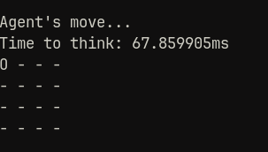
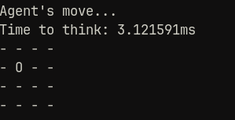
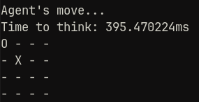

---
titlepage: true
title: "Report 01"
subtitle: "Tic tac toe"
author: [Francisco Galindo Mena, Rodrigo García Peñafort, Andrea Saldaña Navarrete, Gustavo Santana Sánchez]
date: "February, 2025"
toc: true
lang: "en"
listings-disable-line-numbers: true
bibliography: "fuentes.bib"
nocite: |
  @*
...

# Goals

- Develop a code that follows the simple rules of Tic-Tac-Toe game, making random moves on the board.
- Modify it so the agent prevents their opponent from winning and tries to win.
- Modify the code so the agent choose their moves in order to win or get closer to, and optimize it.

# Introduction

An agent in Artificial Intelligence is a computer program or system design to perceive its environment, make decisions and take actions to achieve a specific goal or set of goals. They can be grouped based on their degree or perceived intelligence and capability, in one of this groups can be found the simple reflex agents.

Simple reflex agents ignore the percept history and act only on the basis of the current percept. Their function is based on the condition-action rule. If the condition is true, the action is taken, else not. This agent function only suceeds when the environment is fully observable.

The Tic-Tac-Toe game consist in two players who take turns marking the spaces commonly in a three-by-three grid with X or O. Wins whoever suceeds in placing three of their marks in a horizontal, vertical or diagonal row first.

# Development

In order to meet the goals that were imposed in this practice, we first need to implement a sort of framework in which Tic-Tac-Toe games can be played. This implementation was made in Go, after having trouble making a performant program in Python. Instead of the obvious way of representing the board with a bidimentional array of numbers or characters, we took inspiration from the chess programming community and decided to use a pair of integer numbers. This way, each of the bits of the each number indicate if a player has placed a mark on that tile.

This way of represetation is known as a *bitboard*. And the fact that it is just a couple of numbers means that the algorithm for placing, validating and showing the board can be done with bitwise operators, using just a couple of CPU instructions, instead of having to loop over an array and compare elements individually.

An array of hardcoded winning conditions can be written in order to be compared with the state of the board at the end of each turn so we know when the game has finished and who has won.

With this, the rest of the Tic-Tac-Toe framework is just some driver code so that the agents can play the game.

## 'Random' agent

This is the simplest agent of this practice. There is no deep analysis - or analysis at all-. The agent just picks a random number, which is the index of the tile in which the next move is to be made. If that spot is already picked, a new random number is chosen. There is nothing else to say about this agent. It just follows the rules of the game and winning is just a matter of chance, and imcompetence from the adversary's part.

## 'Desperate' agent

There is a little bit more of a decision being made in this agent. It's main goal is NOT to lose, which means this agent looks only one step in the future every time it's its turn. For each of the free tiles on the board, the algorithm checks if, when the adversary's turn comes, they would win by placing their mark on that tile. If that's the case, the agent places its own mark there, so that the adversary does not have an immediate win. And that's it. Winning is very hard for this agent, because there is no logic at all about searching for winning paths, but it should be a little bit harder to defeat it, because it can see whenever you are about to win and act accordignly. Still, this agent can be defeated, because no real long-term strategy is taking place.

## 'Smart' agent

To some degree, this agent is the main focus of this practice. Its goals are not only not to lose, but actually it tries to get the best result it can, namely it tries to win.

By the professors recommendation, the minimax algorithm was evaluated and used to implement this agent.

### The *minimax* algorithm

This algorithm is the corner-stone of this agent. Its brains, so to say. The way it works, in the most basic terms, is to evaluate all possible game sequences and return whichever has the best result. In this case, winning states are represented by positive integers, and losing ones are negative.

*Minimax* has a recursive nature, which is not surprising. This is because, in order to know if a certain next move is advantageous, further future possibilities have to be evaluated.

*Minimax* works by choosing the next best move based on whatever way the adversary has of responding. The algorithm assumes the adversary is knowledgeable, which means it makes the movement that benefits them the most. Because of this, *minimax* assumes the adversary's next move is the worst for the agent.

As such, two perspectives are taken into account when running this algorithm, a maximizing one and a minimizing one. The maximizer is a proxy for the agent and the minimizer is related to the adversary. In each recursive step, if we have the maximizer perspective, all possible moves that the minimizer can make are evaluated using *minimax* but from the minimizers perspective. We choose whichever move returns the best (*maximum*) score for the maximizer. Then this score is returned.

The algorithm is analogous for the minimizer, but it chooses whichever score is lowest (*minimum*), because it wants to make the move that benefits the agent the least.

The base step of this algorithm is reached whenever the board is full or someone has won. If the agent wins, a positive value is returned, if it looses, then it's negative, and if the board is full (a draw), a score of 0 is taken.

### Modifications and optimizations for *minimax*

*Minimax*, because of its pessimistic and anxious nature, explores the whole decision tree of the game, which makes it painfully slow for a 4x4 game. It's imperative to make some optimizations and modifications to it.

#### The *negamax* algorithm

*Negamax* is not an optimization *per se*, it is just another way of writing the *minimax* algorithm. Instead of having a minimizer and a maximizer case, it levers the fact that:

$$
\min(a,b) = -\max(-a,-b)
$$

This means that we can have a single case -maximizer- which compares the current best score with the $-minimax()$ all the options for next move. The time and memory complexity of the algorithm is not modified, but the code becomes a little bit more terse, which is useful for the optimizations that we will make next.

#### $\alpha$,\ $\beta$ pruning

*alpha-beta* pruning is one of the main, and simplest (in terms of lines of code) optimizations one can make to *negamax* (*minimax*). In this case, the *negamax* function now has new parameters *alpha* and *beta*, which pose as lower and upper bounds for the score that we expect from a certain move.

At each recursive step, a new value for alpha can be computed. Remember that alpha is the lower bound for a guaranteed score. This means the current maximizer cannot do worse than alpha, nor can it do better than beta. If, at any point, $\alpha > \beta$, we know that this bounds are invalid. In other words, this path will not occur under our asumptions. This means that this whole branch can be ignored without changing the score returned.

This process of ignoring some branches can dramatically improve performance, as we will see soon.

#### Transposition table

A given board configuration can be reached by different movement sequences. Since *negamax* can potentially compute all of these different sequences, there is potential for duplicate work because, in Tic-Tac-Toe, the past states do not matter, so scores will be the same. If we use dynamic programming concepts, we can memoize the result of previous configurations so that they can be reused without further computation.

Sometimes, we can get a score from a board configuration, but this score is not definitive, because it is possible to make depth-limited searches. This means that, in the long-term, there could be movements that further improve a board's score, but that weren't computed. Regardless, storing these partial scores is useful, because they can be used as upper and lower bounds for the current computation. This means that pruning could be more effective without doing extra work.

This optimization is of great usefulness for implementing iterative deepening. In fact, iterative deepening would be detremental for performance without a transposition table.

##### Zobrist hashing

Each board configuration, as well as their respective values and flags are stored in a *hash map*. The hashing algorithm used is *zobrist hashing*. This hashing algorithm is based on generating a random number for each movement and each player and XORing each of them based on the board state. The main advantage of this algorithm is that it is fast and can be iteratively composed, this means the hash does not need to be computed from scratch every time a move is made, it can be computed from the current one.

#### Iterative deepening

As of now, *negamax* will 'look into the future' as far as it is told. Which ideally would be until no movements are possible. In practice, this is a depth first search algorithm. This approach ensures completeness of the algorithm, but solutions will not be optimal. Sometimes, the agent will miss early winning opportunities, because it has already chosen another, longer path.

Iterative deepening is an iterative depth first search. It ensures an optimal play when winning conditions are guaranteed. This optimal solution has potential of saving most of the computation, hugely improving performance.

On the other hand, when the current state of the game forces a draw or a lose, this depening causes some repeated computation, which makes it a little slower in those cases.

### Other tweaks

One side-effect that *minimax* & friends have is that it treats all winning conditions the same, as it does with losing conditions. This means that, if at any point the agent knows it is going to lose, it 'loses hope' as well, making the game look 'weird', specially if it is playing against a non optimal adversary, by missing opportunities to change the tide of the game.

Since heuristically a longer defeat is better than a shorter one. The depth of the tree is taken into account when calculating scores. This way, the agent tries to elongate the game as much as it can.

If there are many moves which elongate the game the same amount, it chooses, heuristically, whichever one looks more 'human', in this case, it is a 'desperate move', the same kind that the 'despeate agent' makes.

# Results

## Runtime performance of the 'smart' algorithm

Originally, by implementing a naive *negamax* algorithm, the time to first move from the agent is too long to be practical. There mere fact of adding pruning reduces this time to under 100ms:

After implementing all the optimizations described previously, the performance further improved. Now the time to first move is under 5ms

Like we predicted, the performance when losing is guaranteed is slower, but still useful.

# Conlusions

In conclusion, Minimax is a very effective algorithm for determining the best move given the current player's action. However, when applied to larger boards, it becomes highly inefficient due to the exponential increase in possible responses. For this reason, we decided to use Negamax, a variation of Minimax that eliminates the need for explicit minimization. Nevertheless, this was still not enough to significantly reduce the agent's decision time, so we implemented additional optimizations that drastically lowered the response time compared to the initial approach.

Overall, this was a very interesting exercise, as it provided a better understanding of different algorithms with various applications in artificial intelligence and even in video game development.

# Bibliography
